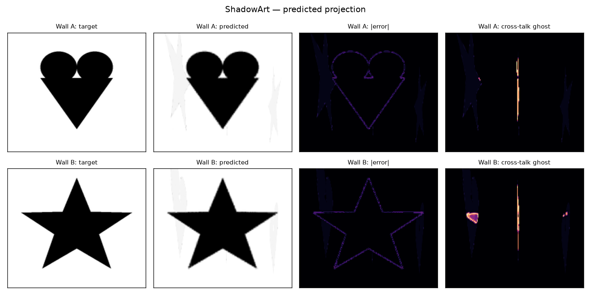

# ShadowArt

Computational shadow-art for a room corner: abstract transparent-acrylic pieces on a
woven lattice of 8 panels that, lit by two floor point-lights at 90°, cast **two
different recognizable images** — one on each adjacent wall. The tool takes two target
images + a scene description, computes what to make opaque on each panel, previews the
predicted projection, and exports machine-ready cut files (DXF + SVG).

v1 is **monochrome** (two black-and-white images). Color (CMYK, 5 material layers) is a
designed-in, deferred extension — see `shadowart/targets/color.py` and the roadmap.



*(Heart on Wall A, star on Wall B — from one set of pieces. Left→right: target,
predicted, error, cross-talk ghost.)*

---

## How it works

1. **Geometry** — a point light + a panel plane + a wall plane define a projective
   **homography** (`geometry/homography.py`). We cache one per (panel, light, wall).
   Parallel planes give a pure magnification `m = dist(L,wall)/dist(L,panel)` → pieces
   near the light are magnified (must be small/coarse), pieces near the wall are ~life
   size (carry the fine detail).
2. **Forward renderer** (`forward/renderer.py`) — the single source of truth, and it is
   *differentiable* (PyTorch). It warps each panel's opacity to each wall, blurs by the
   finite-source **penumbra**, and composites by transmittance `T = ∏(1−α)`. Because
   every panel is warped onto *both* walls, **cross-talk** (a family-A panel ghosting on
   Wall B) appears automatically.
3. **Decompose / solve** — two modes (`solve.mode` in the scene YAML):
   - **`partition`** (default, `solve/decompose.py`) — split each wall's image into
     distinct pieces spread across its depth planes, so no single plane is readable and
     the pieces float as **scattered "hanging shards"** (small far, big near). This is the
     artistic decomposition from the brief.
   - **`optimize`** (`solve/optimizer.py`) — joint two-wall gradient descent minimising
     `‖render_A−target_A‖ + ‖render_B−target_B‖ + sparsity + TV`. Sharpest images, but each
     panel becomes a faded copy of the whole picture (reads as flat planes).
4. **Raster→vector** (`raster2vec/`) — threshold/halftone → enforce minimum feature size
   → contours → kerf offset → shapely polygons.
5. **Fabricate** (`fabricate/`) — add half-lap cross **slots** where the weave
   interlocks, nest onto stock sheets, export **DXF + SVG** per panel (layers:
   `OUTLINE`, `SLOT`, `PIECE`).

## Install

Requires Python ≥ 3.11 (tested on 3.14). On the Intel network, pip must go through the
proxy:

```bash
export HTTPS_PROXY="http://proxy-dmz.intel.com:912"
py -m pip install --proxy "$HTTPS_PROXY" -r requirements.txt
```

Off-network, just `py -m pip install -r requirements.txt`. All dependencies have
Python 3.14 (cp314) wheels, including PyTorch (CPU) and pyclipper.

## Quickstart

```bash
# 1. write two demo target images (heart + star)
py -m shadowart.cli demo --out examples/targets

# 2. inspect the scene geometry (magnification gradient, cross-talk, 3D preview)
py -m shadowart.cli info --scene scenes/example.yaml --out out

# 3. run the whole pipeline (uses demo images if you omit --target-a/-b)
py -m shadowart.cli run --scene scenes/example.yaml \
    --target-a examples/targets/a_heart.png \
    --target-b examples/targets/b_star.png --out out

# 4. open the interactive 3D window to look around (after a run)
py -m shadowart.cli view --scene scenes/example.yaml --out out
#   --rays N   how many light rays to draw (0 = none)
#   --no-open  just write the HTML, don't launch a browser
```

Outputs under `out/`:
- `scene_interactive.html` — **interactive 3D**: drag to orbit, scroll to zoom. Shows the
  shards floating on their panels, both walls textured with the predicted projection, the
  two floor lights, and light rays from each light through the shards to the wall.
- `preview_init.png` / `preview_final.png` — target vs predicted vs error vs cross-talk
- `scene_3d.png` — static 3D snapshot of the woven lattice + lights
- `opacity.npy` — the solved per-panel opacity fields
- `cut/mono/panel_*.dxf` and `.svg` — one cut file per panel

The interactive view uses Plotly (opens in your browser — reliable on any machine and
re-openable). `py -m pip install --proxy "$HTTPS_PROXY" plotly` if you don't have it.

Use your own images: any black-on-white PNG/JPG. Dark = shadow.

## The scene file

`scenes/example.yaml` is fully commented. Key knobs and their physical meaning:

- `lights.*.pos` — floor light positions. Farther away = gentler magnification, weaker
  cross-talk perspective smear, but a longer throw.
- `lights.source_radius` — effective source size → **penumbra**. Bigger = blurrier
  shadows, worse the closer a piece is to the light. This is your resolution limit.
- `panels.familyA.x` / `familyB.y` — must fall **inside the other family's `u_range`** so
  the lattice actually interlocks (otherwise a panel gets no slots).
- `panels.*.v_range` — run it **below** the wall image bottom (`walls.*.z0`) so low-angle
  rays from the floor light still find material; otherwise the bottom of the image can't
  be darkened (the simulator will show this as bright error along the bottom).
- `solve.lambda_sparsity` — higher = more "floating pieces", less material.
- `fab.min_feature`, `fab.kerf`, `fab.sheet_size` — cut constraints; oversize panels are
  flagged for tiling.

## Physics you must calibrate on the bench

The software gets you ~80%; the last 20% is physical:

1. **Penumbra / focus** — measure your real light's blur at the near and far panel depths
   and set `source_radius`. This is the true resolution limit.
2. **Cross-talk ghost** — look at the `cross-talk` column in the preview *before* cutting.
3. **"Clear perspex casts no shadow"** — pieces must actually block light: frost, paint,
   opaque inlay, or vinyl on a clear carrier. Test the method on scrap; laser-cut acrylic
   edges glow. The `PIECE` layer is your opaque shape; `OUTLINE` is the clear carrier.
4. **Alignment sensitivity** — homographies depend on exact light/panel/wall positions.
   Build adjustable mounts and add fiducial pieces that cast known marks to back-solve the
   real geometry.

## Tests

```bash
py -m pytest tests/ -q
```
Covers homography round-trips, analytic magnification, forward-model sanity,
differentiability, and a short end-to-end solve.

## Colour (true CMYK coloured perspex)

```bash
py -m shadowart.cli run --color --scene scenes/example.yaml \
    --target-a examples/apples.jpg --target-b examples/breakfast.jpg --out out_cmyk
```

The picture is split into **C/M/Y/K channels** (`targets/color.py`); each shard is one
process colour of transparent perspex (palette `color.palette`, default **C, M, Y, K**).
Colour projects **subtractively** — `render_color` (`forward/renderer.py`) multiplies the
shards' transmittances along each ray, so overlapping shards **mix** (cyan+magenta → blue,
magenta+yellow → red) and **tone comes from stacking** more/fewer same-colour shards across
the depth planes (`color.max_layers`, default 2). Each shard takes its **dominant** source
colour (so a shard straddling a boundary picks a side rather than fabricating a false mix),
and shards scatter across planes so no single plane reveals the picture.

Outputs in `out_cmyk/`: per-colour cut files (`cut/<C|M|Y|K>.svg|dxf`), clear carrier panels
(`cut/structure/`), a per-vertex-coloured **`shards.ply`**, a colour interactive HTML, and
C/M/Y/K channel previews. See `COMMANDS.txt` §7.

Notes: single perspex thickness → tone is quantised to ~`max_layers` levels per channel
(posterised); very dark rich colours exceed the 4-plane budget and clip slightly; subtractive
blue/green read a little dark (as in real CMYK). Transmittances in `PERSPEX` are tuned so ~2
stacked sheets ≈ a full saturated colour — retune them to your measured acrylic.
